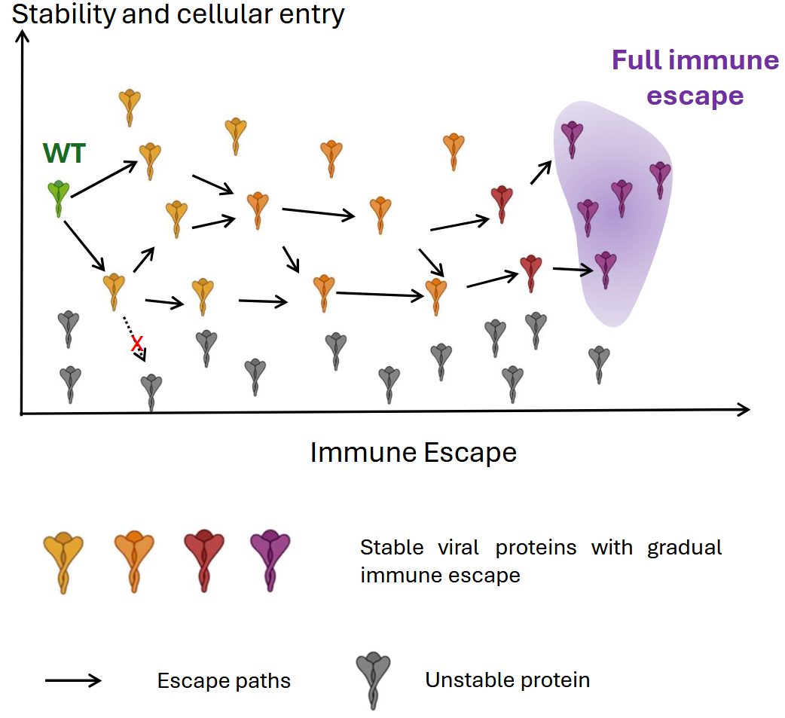

# Escape Funnels

**Escape Funnels** provides an **MCMC and mean-field framework** to study how viral proteins evolve under immune pressure, with a focus on identifying **evolutionary funnels that drive antibody escape**.



---

## Repository Layout

| Path                  | Purpose                                                                                                                                                                     |
|-----------------------|-----------------------------------------------------------------------------------------------------------------------------------------------------------------------------|
| **lattice/**          | Train a Restricted Boltzmann Machine (RBM) on synthetic lattice protein sequences. Demonstrates how evolution is constrained to narrow funnels in protein space.             |
| **covid/**            | Distill information from ESM-IF into an RBM trained on SARS-CoV-2 RBD sequences. Sample escape paths with MCMC, compare their statistics to observed pandemic mutations, and evaluate antibody resilience. |
| **mean_field_theory/**| Apply mean-field approximations to quantify escape funnels in SARS-CoV-2 RBD sequences. Assess the impact of single antibodies and antibody cocktails on viral evolution.   |
| **path/**             | Utilities for implementing MCMC sampling of escape paths and related workflows.                                                                                           |

---

## Citation

If you use **EscapeMap** in your research, please cite:

```bibtex
@article {Huot2025.05.12.653592,
	author = {Huot, Marian and Rosenbaum, Pierre and Planchais, Cyril and Mouquet, Hugo and Monasson, R{\'e}mi and Cocco, Simona},
	title = {Generative model of SARS-CoV-2 variants under functional and immune pressure unveils viral escape potential and antibody resilience},
	elocation-id = {2025.05.12.653592},
	year = {2025},
	doi = {10.1101/2025.05.12.653592},
	publisher = {Cold Spring Harbor Laboratory},
	abstract = {The evolutionary trajectory of SARS-CoV-2 variants is shaped by the selective pressures exerted by host immunity, in particular neutralizing antibodies targeting the receptor-binding domain (RBD). Here, we introduce a data-driven model that quantifies the impact of antibody pressure on RBD evolution and assesses antibody resilience beyond single mutations and known variants. We integrate deep mutational scanning of ACE2 and 31 antibodies with a generative model trained on pre-pandemic Coronaviridae sequences. We then use our generative model to design viable RBD variants under immune pressure from four monoclonal antibodies—SA55, S2E12, S309, and VIR-7229. Experimental validation of 22 variants, with up to 21 mutations from Wuhan wild-type, confirms 50\% expression rate. Binding assays further reveal that S309 and VIR-7229 maintain binding across diverse mutational combinations, while SA55 is escaped by one variant and S2E12 exhibits lower resilience. In addition, our model captures correlated escape across antibody pairs (R = 0.65), guiding the selection of negatively correlated cocktails to reduce shared escape routes. By quantitatively linking viral adaptation to antibody resistance profiles, this framework provides a predictive foundation for optimizing therapeutic strategies and enhancing long-term pandemic preparedness.},
	URL = {https://www.biorxiv.org/content/early/2025/05/13/2025.05.12.653592},
	eprint = {https://www.biorxiv.org/content/early/2025/05/13/2025.05.12.653592.full.pdf},
	journal = {bioRxiv}
}
